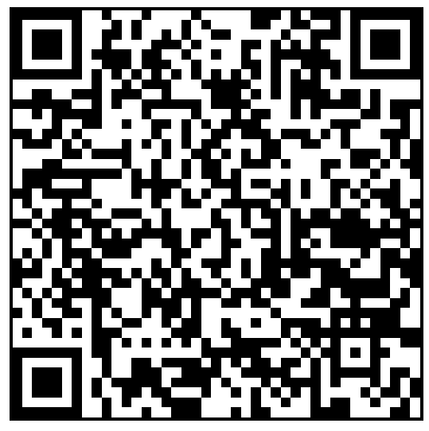

# [sdr-data-browser](https://github.com/lafefspietz/sdr-data-browser)

 - [http://localhost/sdr-data-browser/](http://localhost/sdr-data-browser/)
 - [http://67206fqe.campus.nist.gov/sdr-data-browser/](sdr-data-browser/)
 - [edit-web-files.html](edit-web-files.html)
 - [index.html](index.html)
 - [edit-index.html](edit-index.html)
 - [readme.html](readme.html)
 - [control.json](control.json)
 - [data.json](data.json)

Web based data browser for SDR(software defined radio) large data sets.
